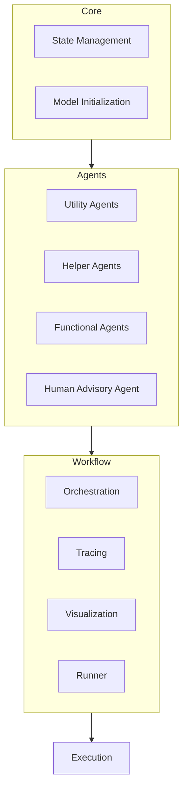
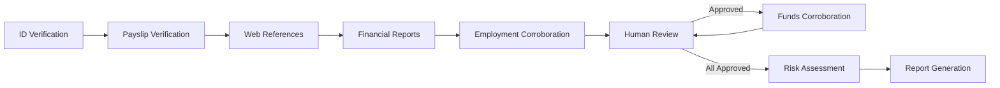
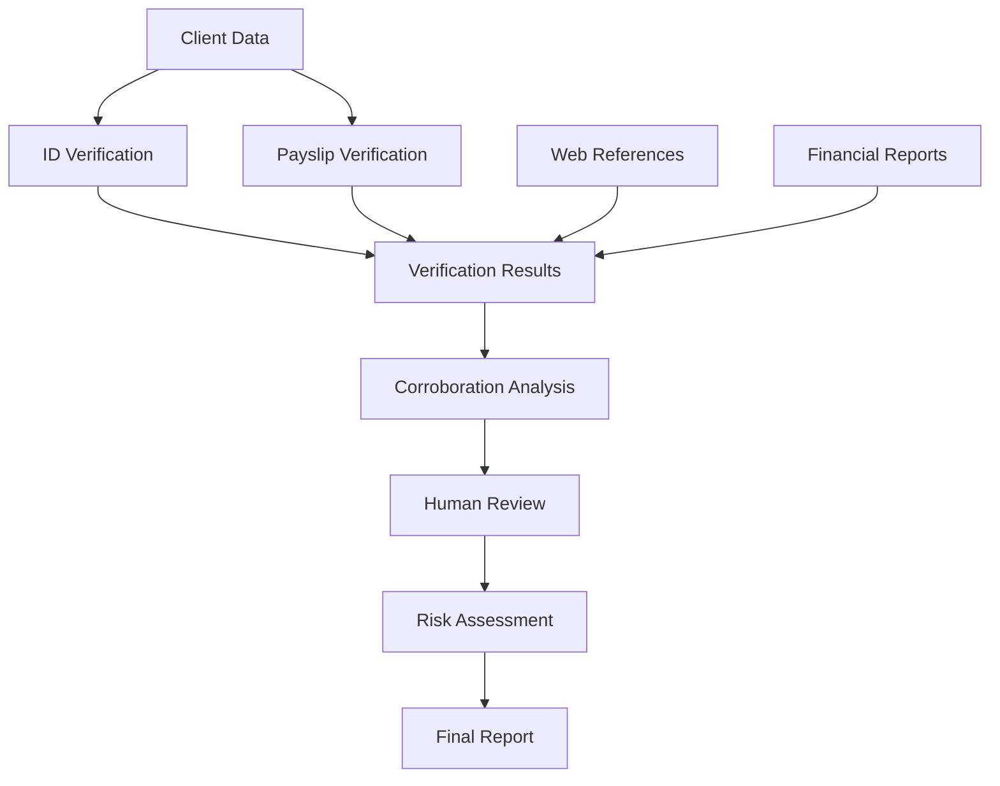

# System Patterns: Source of Wealth Multi-Agent System

## System Architecture

The Source of Wealth Multi-Agent System follows a modular, agent-based architecture organized into distinct layers:



### Core Layer
- **State Management**: Defines the structure of the state that flows through the system and provides utilities for state manipulation.
- **Model Initialization**: Handles the initialization and configuration of language models (OpenRouter and Ollama).

### Agents Layer
- **Utility Agents**: Specialized agents for verification tasks (ID, payslip, web references, financial reports).
- **Helper Agents**: Agents that coordinate data and create reports.
- **Functional Agents**: Agents that perform analysis tasks (employment corroboration, funds corroboration, risk assessment).
- **Advisory Agent**: Human-in-the-loop agent that manages human oversight.

### Workflow Layer
- **Orchestration**: Defines the workflow graph and execution flow between agents.
- **Tracing**: Provides tracing capabilities for monitoring agent interactions.
- **Visualization**: Generates visualizations of the workflow and results.
- **Runner**: Executes the workflow with or without tracing.

## Key Technical Decisions

### 1. State-Based Agent Communication

**Decision**: Use a shared state object that flows through the agent workflow.

**Rationale**:
- Provides a clear, structured way to pass information between agents
- Enables easy tracking of changes through the workflow
- Simplifies debugging and visualization
- Aligns with LangGraph's state-based workflow model

**Implementation**:
```python
class AgentState(TypedDict, total=False):
    # Client information
    client_id: str
    client_name: Optional[str]
    client_data: Dict[str, Any]
    
    # Verification results
    id_verification: Optional[IDVerificationResult]
    payslip_verification: Optional[PayslipVerificationResult]
    # ...other fields...
```

### 2. Dual-Model Approach

**Decision**: Use different language models based on data sensitivity.

**Rationale**:
- Ensures sensitive client data remains local
- Leverages cloud models for external data analysis
- Balances privacy concerns with performance requirements

**Implementation**:
```python
# OpenRouter model for general tasks
openrouter_model = initialize_openrouter_model(
    model_name="qwen/qwen3-110b",
    temperature=0.7
)

# Local Ollama model for sensitive data
ollama_model = initialize_ollama_model(
    model_name="mistral-small3.1",
    base_url="http://[ip]:11434",
    temperature=0.7
)
```

### 3. Directed Graph Workflow

**Decision**: Use LangGraph's StateGraph for workflow orchestration.

**Rationale**:
- Provides a clear, visual representation of the workflow
- Enables conditional branching based on state
- Simplifies complex agent interactions
- Supports tracing and visualization

**Implementation**:
```python
workflow = StateGraph(AgentState)
workflow.add_node("id_verification_node", id_agent.run)
# ...add other nodes...
workflow.add_edge("id_verification_node", "payslip_verification_node")
# ...add other edges...
workflow.add_conditional_edges(
    "human_review_node",
    route_after_human_review,
    {
        "employment_corroboration_node": "employment_corroboration_node",
        "funds_corroboration_node": "funds_corroboration_node",
        "risk_assessment_node": "risk_assessment_node"
    }
)
```

### 4. Human-in-the-Loop Design

**Decision**: Implement explicit human approval steps for critical verification points.

**Rationale**:
- Ensures human oversight for important decisions
- Combines automation efficiency with human judgment
- Addresses regulatory requirements for human review
- Builds trust in the system's recommendations

**Implementation**:
```python
def human_advisory_agent(state: AgentState) -> AgentState:
    # ...
    if "employment_corroboration" in state and "employment_corroboration" not in state.get("human_approvals", {}):
        print("\n===== HUMAN INPUT REQUIRED: Employment Corroboration =====")
        print(f"Employment corroboration result: {json.dumps(state['employment_corroboration'], indent=2)}")
        decision = input("Approve this check? (yes/no): ").lower().strip()
        approved = decision == "yes"
        
        if "human_approvals" not in new_state:
            new_state["human_approvals"] = {}
        new_state["human_approvals"]["employment_corroboration"] = approved
    # ...
```

### 5. Comprehensive Tracing and Visualization

**Decision**: Implement detailed tracing and visualization of agent interactions.

**Rationale**:
- Provides transparency into the workflow execution
- Helps identify bottlenecks and optimization opportunities
- Supports debugging and troubleshooting
- Enhances explainability for users and auditors

**Implementation**:
```python
class AgentInteractionTracer:
    # ...
    def record_interaction(self, from_agent: str, to_agent: str, data: Any = None):
        elapsed = time.time() - self.start_time
        self.interactions.append({
            "from": from_agent,
            "to": to_agent,
            "timestamp": elapsed,
            "data": data
        })
        # ...
    
    def visualize_interactions(self):
        # Create visualization of agent interactions
        # ...
```

## Component Relationships

### Agent Interaction Flow



### Data Flow



## Critical Implementation Paths

### 1. Verification Workflow
- ID Verification → Payslip Verification → Web References → Financial Reports

### 2. Corroboration Workflow
- Employment Corroboration → Human Review → Funds Corroboration → Human Review

### 3. Assessment Workflow
- Risk Assessment → Report Generation

### 4. Human Oversight Path
- Employment Corroboration → Human Review
- Funds Corroboration → Human Review
