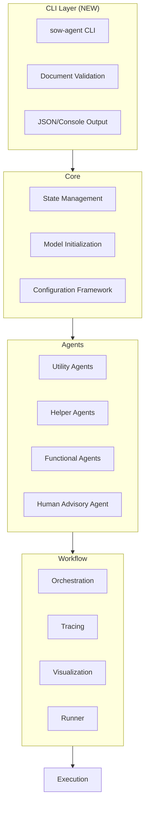

# System Patterns: Source of Wealth Multi-Agent System

## System Architecture

The Source of Wealth Multi-Agent System follows a modular, agent-based architecture organized into distinct layers with a production-ready CLI interface:



### CLI Layer (NEW)
- **sow-agent CLI**: Complete command-line interface with Click framework
- **Document Validation**: File existence and readability verification
- **JSON/Console Output**: Structured reporting and user-friendly display

### Core Layer
- **State Management**: Enhanced SOW state with document handling and framework integration
- **Model Initialization**: Handles the initialization and configuration of language models (OpenRouter and Ollama)
- **Configuration Framework**: Integrated with agent playground configuration system

### Agents Layer
- **Utility Agents**: Specialized agents for verification tasks (ID, payslip, web references, financial reports)
- **Helper Agents**: Agents that coordinate data and create reports
- **Functional Agents**: Agents that perform analysis tasks (employment corroboration, funds corroboration, risk assessment)
- **Advisory Agent**: Human-in-the-loop agent that manages human oversight

### Workflow Layer
- **Orchestration**: Defines the workflow graph and execution flow between agents
- **Tracing**: Provides tracing capabilities for monitoring agent interactions
- **Visualization**: Generates visualizations of the workflow and results
- **Runner**: Executes the workflow with or without tracing

## Key Technical Decisions

### 1. **NEW**: CLI Integration Pattern

**Decision**: Implement a complete CLI interface using Click framework with proper entry point configuration.

**Rationale**:
- Provides production-ready interface for banking systems
- Enables automation and batch processing
- Standardizes input validation and output formatting
- Integrates seamlessly with existing workflow infrastructure

**Implementation**:
```python
@click.group()
@click.option('--verbose', '-v', is_flag=True, help='Enable verbose logging')
@click.pass_context
def main(ctx, verbose):
    """Source of Wealth (SOW) Agent CLI."""
    ctx.ensure_object(dict)
    ctx.obj['verbose'] = verbose

@main.command()
@click.argument('client_id')
@click.argument('client_name')
@click.option('--id', 'id_document', type=click.Path(exists=True))
@click.option('--payslip', type=click.Path(exists=True))
@click.option('--output', '-o', type=click.Path())
def verify(ctx, client_id, client_name, id_document, payslip, output):
    """Verify client's source of wealth through document analysis."""
    # Document validation and workflow execution
```

### 2. Enhanced State-Based Agent Communication

**Decision**: Use a shared state object with annotated types for efficient updates.

**Rationale**:
- Provides a clear, structured way to pass information between agents
- Enables efficient state updates without copying the entire state
- Simplifies debugging and visualization
- Aligns with LangGraph's state-based workflow model

**Implementation**:
```python
class AgentState(TypedDict, total=False):
    # Client information
    client_id: str
    client_name: Optional[str]
    client_data: Dict[str, Any]
    messages: Annotated[List[str], operator.add]  # Multiple agents can add messages
    
    # Verification results
    id_verification: IDVerificationResult
    payslip_verification: PayslipVerificationResult
    # ...other fields...
    
    # Verification planning and tracking
    verification_plan: VerificationPlan
    current_verification_step: str
    completed_verifications: Annotated[List[str], operator.add]
    
    # Process management
    audit_log: Annotated[List[AuditLogEntry], operator.add]
    action_history: Annotated[List[Dict[str, Any]], operator.add]
    errors: Annotated[List[Dict[str, Any]], operator.add]
```

### 2. Dual-Model Approach

**Decision**: Use different language models based on data sensitivity.

**Rationale**:
- Ensures sensitive client data remains local
- Leverages cloud models for external data analysis
- Balances privacy concerns with performance requirements

**Implementation**:
```python
# OpenRouter model for general tasks
openrouter_model = initialize_openrouter_model(
    model_name="qwen/qwen3-110b",
    temperature=0.7
)

# Local Ollama model for sensitive data
ollama_model = initialize_ollama_model(
    model_name="mistral-small3.1",
    base_url="http://[ip]:11434",
    temperature=0.7
)
```

### 3. Dynamic Directed Graph Workflow

**Decision**: Use LangGraph's StateGraph with dynamic routing for workflow orchestration.

**Rationale**:
- Provides a clear, visual representation of the workflow
- Enables dynamic verification planning based on risk assessment
- Enforces sequential verification for critical steps
- Supports conditional branching based on verification results
- Simplifies complex agent interactions
- Supports tracing and visualization

**Implementation**:
```python
workflow = StateGraph(AgentState)

# Add nodes
workflow.add_node("risk_assessment_node", risk_assessment_agent)
workflow.add_node("id_verification_node", id_agent.run)
# ...add other nodes...

# Define workflow entry point - start with risk assessment for planning
workflow.add_edge("__start__", "risk_assessment_node")

# Risk assessment node determines the next verification step
workflow.add_conditional_edges(
    "risk_assessment_node",
    route_after_risk_assessment,
    {
        "id_verification_node": "id_verification_node",
        "payslip_verification_node": "payslip_verification_node",
        "web_references_node": "web_references_node",
        "financial_reports_node": "financial_reports_node",
        "summarization_node": "summarization_node",
        "human_advisory_node": "human_advisory_node"
    }
)

# After each verification, check for issues and route to human review if needed
workflow.add_conditional_edges(
    "id_verification_node",
    verification_needs_human_review,
    {
        "human_advisory_node": "human_advisory_node",
        "risk_assessment_node": "risk_assessment_node"
    }
)
```

### 4. Enhanced Human-in-the-Loop Design

**Decision**: Implement dynamic routing to human review based on verification issues.

**Rationale**:
- Ensures human oversight for important decisions
- Routes to human review only when issues are detected
- Combines automation efficiency with human judgment
- Addresses regulatory requirements for human review
- Builds trust in the system's recommendations

**Implementation**:
```python
def verification_needs_human_review(state: AgentState) -> str:
    """
    Determine if a verification step needs human review based on issues found.
    ID verification is a critical first step that blocks all other steps,
    so its issues are always prioritized for human review.
    """
    # Handle ID verification issues with highest priority
    if "id_verification" in state and state["id_verification"].get("issues_found"):
        print("⚠️ CRITICAL: ID verification issues detected - requesting immediate human review")
        # Mark this as requiring special attention since it blocks the entire workflow
        state["id_verification_critical_issues"] = True
        return "human_advisory_node"
    
    # Only check other verification issues if ID verification was successful
    # or has been approved by human override - this enforces the sequential requirement
    id_verified = state.get("id_verification", {}).get("verified", False)
    human_approved_id = state.get("human_approvals", {}).get("id_verification", {}).get("approved", False)
    
    if id_verified or human_approved_id:
        if "payslip_verification" in state and state["payslip_verification"].get("issues_found"):
            return "human_advisory_node"
        
        # Check other verification types...
    
    # If no human review needed, return to risk assessment for next steps
    return "risk_assessment_node"
```

```python
class HumanApprovalDetail(TypedDict):
    approved: bool
    review_date: str
    issues_at_review: Optional[List[str]]
    reviewer_comments: Optional[str]  # Optional field for comments
```

### 5. Comprehensive Tracing and Visualization

**Decision**: Implement detailed tracing and visualization of agent interactions.

**Rationale**:
- Provides transparency into the workflow execution
- Helps identify bottlenecks and optimization opportunities
- Supports debugging and troubleshooting
- Enhances explainability for users and auditors

**Implementation**:
```python
class AgentInteractionTracer:
    # ...
    def record_interaction(self, from_agent: str, to_agent: str, data: Any = None):
        elapsed = time.time() - self.start_time
        self.interactions.append({
            "from": from_agent,
            "to": to_agent,
            "timestamp": elapsed,
            "data": data
        })
        # ...
    
    def visualize_interactions(self):
        # Create visualization of agent interactions
        # ...
```

## Component Relationships

### Dynamic Agent Interaction Flow


### Enhanced Data Flow


## Critical Implementation Paths

### 1. Dynamic Verification Planning
- Risk Assessment → Verification Plan → Sequential Verification Steps

### 2. Sequential Verification Workflow
- ID Verification (mandatory first step) → Payslip Verification → Web References → Financial Reports

### 3. Human Review Workflow
- Verification Step → Issue Detection → Human Review → Risk Assessment

### 4. Final Assessment Workflow
- Summarization → Final Risk Assessment → Report Generation

### 5. Human Oversight Path
- ID Verification Issues → Human Review (highest priority)
- Other Verification Issues → Human Review (only after ID verification)

## **NEW**: CLI Usage Patterns

### 1. Basic Verification Pattern
```bash
# Single client verification with essential documents
sow-agent verify CLIENT_123 "John Doe" --id documents/id.pdf --payslip documents/payslip.pdf
```

### 2. Comprehensive Verification Pattern
```bash
# Full verification with all supported document types
sow-agent verify CLIENT_456 "Jane Smith" \
  --id id.pdf \
  --payslip payslip.pdf \
  --bank-statement statement.pdf \
  --employment-letter employment.pdf \
  --tax-document tax.pdf \
  --output report.json
```

### 3. Batch Processing Pattern
```bash
# Process multiple clients in sequence
for client in clients.txt; do
  sow-agent verify $client "$(lookup_name $client)" \
    --id "documents/${client}/id.pdf" \
    --payslip "documents/${client}/payslip.pdf" \
    --output "reports/${client}.json"
done
```

### 4. System Integration Pattern
```bash
# Integration with banking systems
sow-agent verify $CLIENT_ID "$CLIENT_NAME" \
  --id "$DOCUMENT_PATH/id.pdf" \
  --payslip "$DOCUMENT_PATH/payslip.pdf" \
  --output "$REPORT_PATH/${CLIENT_ID}.json" && \
process_report "$REPORT_PATH/${CLIENT_ID}.json"
```

### 5. Debugging and Monitoring Pattern
```bash
# Verbose execution for troubleshooting
sow-agent --verbose verify CLIENT_789 "Bob Johnson" \
  --id id.pdf \
  --payslip payslip.pdf \
  --output debug_report.json 2>&1 | tee verification.log
```
