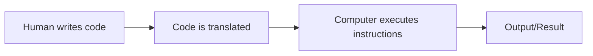
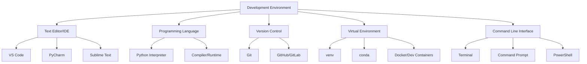
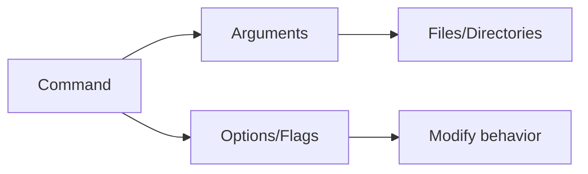
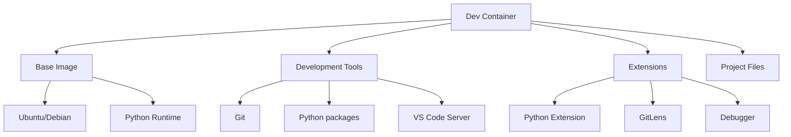
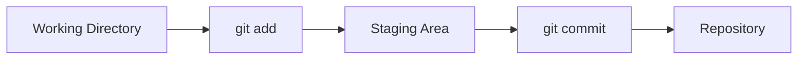

# Lesson 1: Introduction to Coding and Development Environment 🚀

**Duration**: 1 hour ⏰  
**Prerequisites**: None  
**Goal**: Understand what coding is, set up a development environment, and learn basic command line operations

## Learning Objectives 🎯

By the end of this lesson, you will be able to:
- Explain what programming and coding are
- Understand the concept of virtual environments
- Navigate the command line interface
- Set up a development environment using dev containers
- Understand the software development workflow

## 1. What is Coding? 💻 (15 minutes)

### Definition
Coding (or programming) is the process of creating instructions for computers to follow. These instructions are written in a programming language that the computer can understand and execute.

### Why Learn to Code? 🌟
- **Problem Solving** 🧩: Break down complex problems into manageable steps
- **Automation** ⚡: Make repetitive tasks automatic
- **Career Opportunities** 💼: High demand for programmers across industries
- **Creativity** 🎨: Build apps, websites, games, and tools
- **Logical Thinking** 🧠: Develop structured thinking patterns

### How Computers Understand Code



### Programming Languages 🗣️
Different programming languages serve different purposes:
- **Python** 🐍: General purpose, data science, web development
- **JavaScript** 🌐: Web development, front-end interactions
- **Java** ☕: Enterprise applications, Android development
- **C++** ⚙️: System programming, game development
- **SQL** 🗄️: Database queries and management

## 2. Development Environment Overview 🛠️ (20 minutes)

### What is a Development Environment?
A development environment is a collection of tools and software that programmers use to write, test, and debug code.

### Components of a Development Environment



### Virtual Environments 📦
Virtual environments are isolated spaces where you can install packages and dependencies for specific projects without affecting your system's global installation.

#### Why Use Virtual Environments? 🤔
- **Isolation** 🏠: Keep project dependencies separate
- **Reproducibility** 🔄: Ensure code works the same way on different machines
- **Version Management** 📊: Use different versions of packages for different projects
- **Cleanliness** ✨: Avoid conflicts between packages

#### Types of Virtual Environments 🏗️
1. **Python venv** 🐍: Built-in Python virtual environment
2. **Conda** 🅰️: Package and environment manager
3. **Docker** 🐳: Containerized environments
4. **Dev Containers** 📋: VS Code's containerized development environment

## 3. Command Line Interface (CLI) 💻 (20 minutes)

### What is the Command Line?
The command line interface (CLI) is a text-based way to interact with your computer's operating system. Instead of clicking on icons, you type commands.

### Why Learn the Command Line? 🚀
- **Efficiency** ⚡: Faster than using graphical interfaces for many tasks
- **Automation** 🤖: Can script repetitive tasks
- **Remote Access** 🌐: Essential for working with servers
- **Developer Tools** 🔧: Many programming tools are command-line based

### Basic Command Line Concepts



### Essential Commands 📝

#### Navigation Commands 🧭
```bash
# Show current directory
pwd

# List files and directories
ls          # Basic list
ls -la      # Detailed list with hidden files

# Change directory
cd /path/to/directory
cd ..       # Go up one level
cd ~        # Go to home directory
cd          # Go to home directory (shortcut)
```

#### File and Directory Operations 📁
```bash
# Create directory
mkdir new_folder

# Create file
touch new_file.txt

# Copy files
cp source.txt destination.txt
cp -r source_folder/ destination_folder/

# Move/rename files
mv old_name.txt new_name.txt
mv file.txt /path/to/destination/

# Remove files and directories
rm file.txt
rm -r folder_name/  # Remove directory and contents
```

#### Viewing File Contents 👀
```bash
# Display file contents
cat file.txt        # Show entire file
head file.txt       # Show first 10 lines
tail file.txt       # Show last 10 lines
less file.txt       # View file page by page
```

### Command Line Tips 💡
- Use **Tab** for auto-completion
- Use **↑** and **↓** arrows to navigate command history
- Use **Ctrl+C** to cancel a running command
- Use **clear** to clear the terminal screen

## 4. Setting Up Dev Containers 🐳 (15 minutes)

### What are Dev Containers?
Dev Containers are a way to use Docker containers as a full-featured development environment. They provide a consistent, reproducible development setup.

### Benefits of Dev Containers ✨
- **Consistency** 🔄: Same environment for all developers
- **Quick Setup** ⚡: No need to install dependencies locally
- **Isolation** 🏠: Don't pollute your local machine
- **Portability** 📦: Works on any machine with Docker

### Dev Container Structure



### Basic Dev Container Configuration
A dev container is configured using a `.devcontainer` folder with configuration files:

```
.devcontainer/
├── devcontainer.json    # Main configuration
└── Dockerfile           # Custom container setup (optional)
```

### Example devcontainer.json
```json
{
    "name": "Python Development",
    "image": "mcr.microsoft.com/vscode/devcontainers/python:3.11",
    "features": {
        "ghcr.io/devcontainers/features/git:1": {}
    },
    "customizations": {
        "vscode": {
            "extensions": [
                "ms-python.python",
                "ms-python.pylint"
            ]
        }
    },
    "postCreateCommand": "pip install -r requirements.txt"
}
```

## 5. Quick Introduction to Git 🌳 (5 minutes)

### What is Git? 📚
Git is a version control system that tracks changes in your code over time. It's essential for:
- **Tracking Changes** 📝: See what changed, when, and why
- **Collaboration** 👥: Multiple people can work on the same project
- **Backup** 💾: Your code history is preserved
- **Branching** 🌿: Work on different features simultaneously

### Basic Git Workflow



### Essential Git Commands 🔧
```bash
# Initialize a new repository
git init

# Check status of files
git status

# Add files to staging area
git add filename.txt
git add .                # Add all files

# Commit changes
git commit -m "Your commit message"

# View commit history
git log --oneline
```

### Quick Git Exercise 🏃‍♂️
```bash
# In your coding_practice directory
git init
git add .
git commit -m "Initial commit - my first coding lesson"
git log --oneline
```

## 6. Your First Python Experience 🐍 (10 minutes)

### Launching Python Interactive Mode 🚀
Python comes with an interactive interpreter where you can type Python code and see results immediately.

```bash
# Type this in your terminal
python
```

You should see something like:
```
Python 3.11.0 (main, Oct 24 2022, 18:26:48)
[GCC 9.4.0] on linux
Type "help", "copyright", "credits" or "license" for more information.
>>>
```

The `>>>` is called the Python prompt - it means Python is ready for your commands! 🎉

### Your First Python Commands 🎯
Try these simple commands in the Python interpreter:

```python
# Create a variable
a = 1

# Display the variable
print(a)

# Or simply type the variable name
a

# Try some basic math
b = 2
c = a + b
print(c)

# Work with text
name = "Coder"
print("Hello, " + name + "!")

# Exit Python
exit()
```

### What Just Happened? 🤯
- **Variables** 📦: `a = 1` creates a variable named `a` and stores the value `1`
- **Display** 📺: `print(a)` shows the value of variable `a`
- **Calculations** 🧮: Python can do math with variables
- **Strings** 📝: Text in quotes creates a string variable

This is your first taste of Python programming! Don't worry about understanding everything - we'll cover it all in detail in Lesson 2. 🎓

## 7. Practical Exercise 🛠️ (10 minutes)

### Exercise: Command Line Navigation 🗺️
1. Open your terminal/command prompt
2. Check your current directory with `pwd`
3. List all files and directories with `ls -la` (or `dir` on Windows)
4. Create a new directory called `coding_practice`
5. Navigate into the new directory
6. Create a file called `hello.txt`
7. Add some text to the file using a text editor
8. Display the file contents using `cat hello.txt`

### Exercise Solution
```bash
# Check current directory
pwd

# List files
ls -la

# Create directory
mkdir coding_practice

# Navigate to directory
cd coding_practice

# Initialize git repository
git init

# Create file
touch hello.txt

# Edit file (using nano, vim, or any text editor)
echo "Hello, World! This is my first coding lesson." > hello.txt

# Display contents
cat hello.txt

# Add to git
git add .
git commit -m "Added hello.txt file"

# Try Python
python
# In Python interpreter:
# >>> a = 1
# >>> print(a)
# >>> exit()
```

### Extended Exercise: Python Practice 🐍
1. Launch Python by typing `python` in your terminal
2. Create these variables:
   ```python
   my_age = 25
   my_name = "Student"
   is_learning = True
   ```
3. Display each variable using `print()` 📺
4. Try some calculations:
   ```python
   years_coding = 1
   future_age = my_age + years_coding
   print("In one year, I'll be", future_age, "years old")
   ```
5. Exit Python with `exit()` 👋

## Summary 📋

In this lesson, we covered:
- What programming and coding are 💻
- The importance of development environments 🛠️
- Virtual environments and their benefits 📦
- Basic command line navigation and operations 🧭
- Introduction to dev containers 🐳
- **Git basics for version control** 🌳
- **Your first Python commands and variables** 🐍

## Next Steps 🚶‍♂️

1. Practice the command line exercises 💪
2. **Try more Python commands in the interactive interpreter** 🐍
3. **Initialize git repositories for your practice projects** 📚
4. Familiarize yourself with your text editor or IDE 📝
5. Set up a dev container (if using VS Code) 🐳
6. Prepare for Lesson 2: Python Basics 🎯

## Additional Resources 📖

- [Command Line Crash Course](https://learnpythonthehardway.org/book/appendixa.html)
- [VS Code Dev Containers](https://code.visualstudio.com/docs/remote/containers)
- [Git Command Line Tutorial](https://git-scm.com/docs/gittutorial)
- **[Python Interactive Tutorial](https://docs.python.org/3/tutorial/interpreter.html)**
- **[Git Handbook](https://guides.github.com/introduction/git-handbook/)**

---

**Homework** 📚: 
1. Practice using the command line for 15 minutes daily 💻
2. **Launch Python and practice creating variables with different types of data (numbers, text, true/false)** 🐍
3. **Create a git repository for your coding practice and make your first commit** 🌳
4. **Try calculating your age in days using Python: `age_in_years * 365`** 🧮
