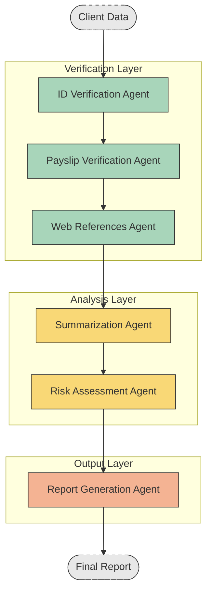

```mermaid
graph TD;
    subgraph "Verification Layer"
        ID[ID Verification Agent]
        Payslip[Payslip Verification Agent]
        Web[Web References Agent]
    end
    
    subgraph "Analysis Layer"
        Summary[Summarization Agent]
        Risk[Risk Assessment Agent]
    end
    
    subgraph "Output Layer"
        Report[Report Generation Agent]
    end
    
    Client([Client Data]) --> ID
    ID --> Payslip
    Payslip --> Web
    Web --> Summary
    Summary --> Risk
    Risk --> Report
    Report --> FinalReport([Final Report])
    
    classDef verification fill:#a8d5ba,stroke:#333,stroke-width:1px;
    classDef analysis fill:#f9d876,stroke:#333,stroke-width:1px;
    classDef output fill:#f4b393,stroke:#333,stroke-width:1px;
    classDef external fill:#e8e8e8,stroke:#333,stroke-width:1px,stroke-dasharray: 5 5;
    
    class ID,Payslip,Web verification;
    class Summary,Risk analysis;
    class Report output;
    class Client,FinalReport external;
```
